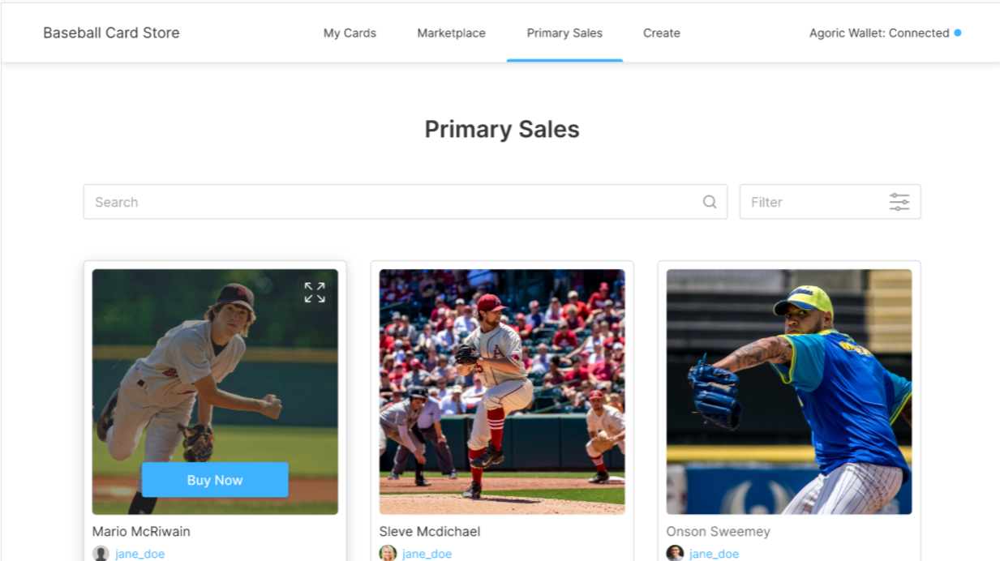

# Baseball Card Store Dapp

The Baseball Card Store Dapp is a Marketplace place for nfts which in this case are baseball cards.

There are four main views in the Card Store dapp:

1. `MyCards Section` : Where a user can view the nfts that he owns and put a nft on sale if he wants.
2. `Secondary Marketplace` : Using this a user can buy nfts put on sale by other users.
3. `Primary Marketplace` : Here the user can buy the nfts put on sale by agoric.
4. `Minting Nfts` : Any user can mint new nfts which will be deposited to user wallet as soon as minting completes.

Install the
[prerequisites](https://agoric.com/documentation/getting-started/before-using-agoric.html).

Then in a first terminal in the directory where you want to put your dapp, install the dapp:

```sh
agoric init --dapp-template dapp-card-store my-card-store
cd my-card-store
agoric install
# If the Agoric platform has not been started
agoric start --reset --verbose
```

In a second terminal, enter `agoric open` in a terminal window to open a wallet.

When the UI changes from gray to white (be patient), transfer some
funds from the **Agoric RUN currency** purse to the **Zoe fees**
purse.

```sh
agoric deploy contract/deploy.js api/deploy.js
```

In a third terminal,

```sh
# Navigate to the `ui` directory and start a local server
cd ui && yarn start
```

## Using the Dapp

1. `yarn start` will open a page at http://127.0.0.1:3001.
2. Follow the detail in the popup to connect to wallet.
3. `agoric open` will open a window for your wallet.
4. On accepting dapp connection nfts for sale should appear in primary marketplace.
5. Now you should be able to click on a card to make an offer to buy it.
6. Approve the offer in your wallet.
7. View the card in your wallet.



To learn more about how to build Agoric Dapps, please see the [Dapp Guide](https://agoric.com/documentation/dapps/).

To See the [Dapp Multi User Guide](https://agoric.com/documentation/guides/agoric-cli/starting-multiuser-dapps.html#example) for how to deploy this Dapp on a testnet and experience this dapp with multi user.
